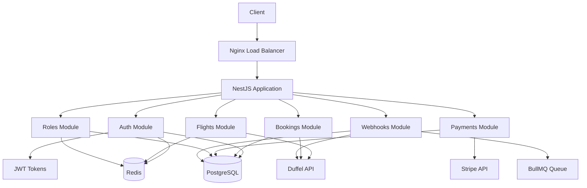
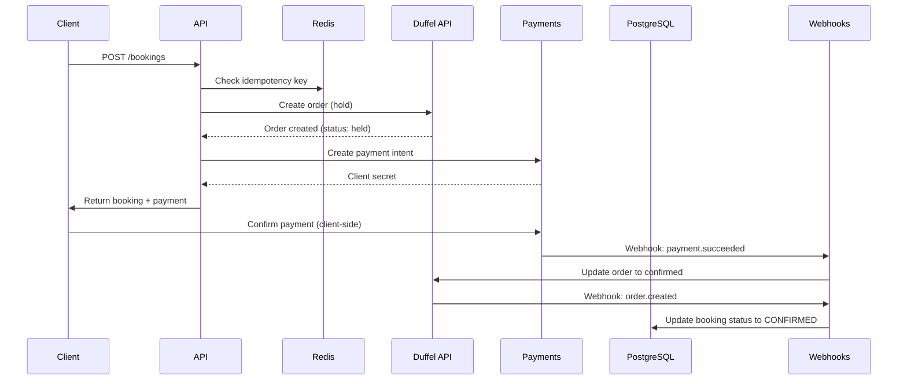
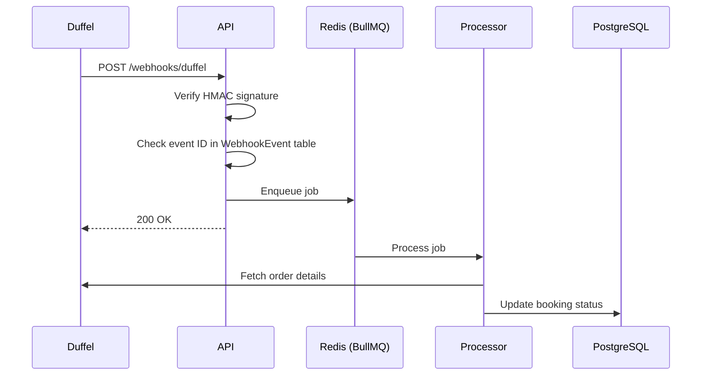

# Architecture

## System Overview

Skylane is a NestJS backend application that integrates with Duffel API for flight
content and Stripe for payment processing. It uses PostgreSQL for persistent storage and
Redis for caching, rate limiting, and job queues.

## Architecture Diagram

## Component Details

### Authentication & Authorization

- **JWT Strategy**: Access tokens (15 min) + Refresh tokens (7 days)
- **Refresh Token Rotation**: On every refresh, the old token is revoked and a new one issued
- **Reuse Detection**: If a revoked/expired token is replayed, all tokens in the family are revoked
- **Dynamic RBAC**: Roles and permissions are data-driven, not hardcoded
- **Permission Catalog**: Defined in code (`permissions.registry.ts`), roles composed from this catalog

### Flight Search

1. Client sends search request with origin, destination, dates, passengers
2. Service checks Redis cache for cached results (900s TTL)
3. If cache miss, delegates to `DuffelService` to query Duffel API
4. Results cached and returned to client

### Booking Flow

### Idempotency

- Booking creation uses an idempotency key
- The key is stored on the Booking record
- Duplicate requests with the same key return the existing booking
- This prevents double-charging if a client retries after a timeout

### Webhook Processing

### Rate Limiting

| Route              | TTL (ms) | Limit |
|-------------------|----------|-------|
| Default           | 60,000   | 100   |
| /auth/login       | 900,000  | 5     |
| /auth/register    | 900,000  | 5     |

## Data Flow

### Search → Offer → Order → Payment → Confirmation

1. **Search**: Client searches for flights via `/flights/search`
2. **Offer**: Client retrieves offer details via `/flights/offers/:id`
3. **Order**: Client creates booking via `/bookings` (holds order, creates payment intent)
4. **Payment**: Client confirms payment (Stripe client-side)
5. **Webhook**: Stripe sends `payment.succeeded` → Duffel webhook arrives → Booking status updated to `CONFIRMED`

### Retry Handling

- Duffel webhooks: Idempotent by event ID, retries are no-ops
- Stripe webhooks: Stripe retries on non-2xx responses, but we always return 200
- Payment capture: Manual capture allows cancellation before settlement

## Technology Stack

| Layer        | Technology          |
|-------------|---------------------|
| Framework    | NestJS 12 (ESM-only)|
| Language     | TypeScript (strict) |
| Database     | PostgreSQL / MySQL / MongoDB |
| ORM          | Prisma 6 (multi-provider schemas) |
| Cache/Queue  | Redis 7 (ioredis)   |
| Auth         | JWT + Passport      |
| Password Hash| Argon2              |
| Flight Data  | Duffel API          |
| Payments     | Stripe              |
| Logging      | Pino (JSON)         |
| Testing      | Vitest              |

## Deployment

See README.md "Choose Your Deployment" section.
